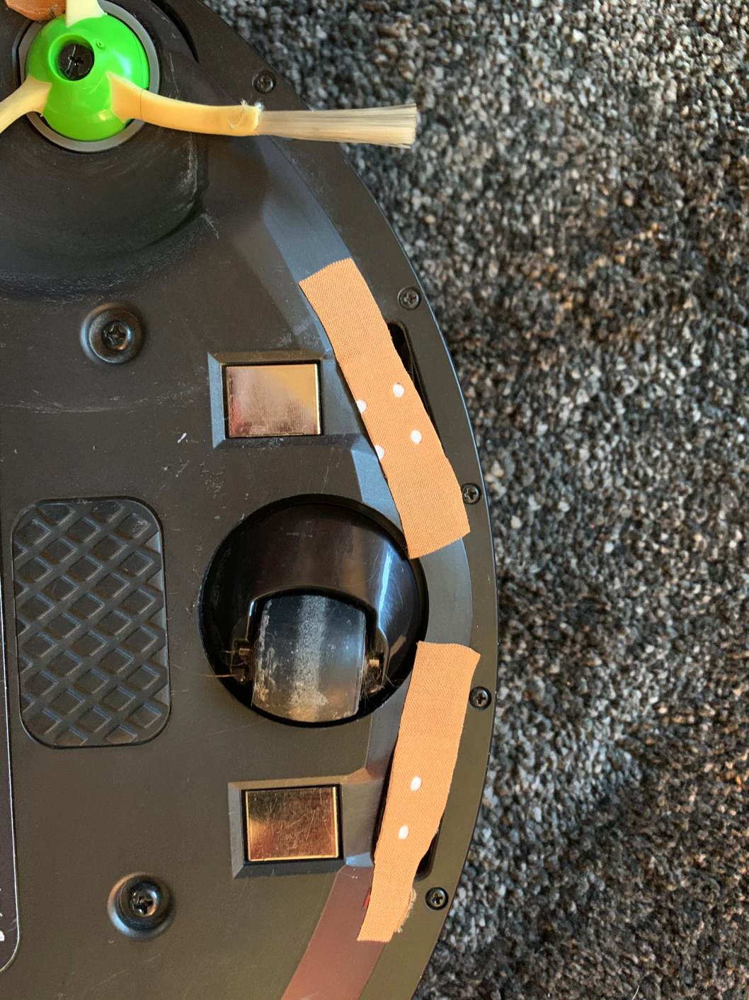
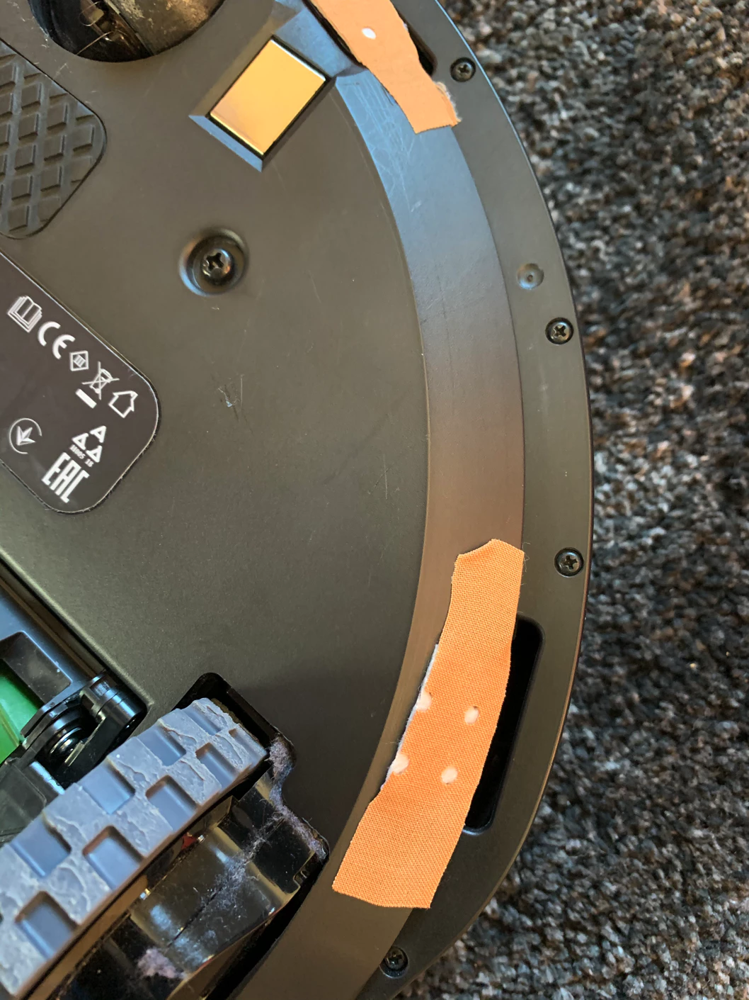

Hacking is not only a computer science discipline. It's a way of thinking about things around you.

I've recently bought a dark carpet for my living room. It's fantastic.

After few days I started my iRobot to clean the room only to notice that it avoids the carpet like a plague.

So I've put it on the carpet thinking it's not able to enter it due to its thickness. I was wrong.

Roomba refused to run saying "Error-6, move your iRobot to another place".

After some googling it seemed that the cliff edge sensors goes bananas on very dark places, like carpets.

The cliff edge sensor works with light. It emits some light and looks how much it sees back. Quite like a laser mouse.

I have no stairs or other "cliffs" that this robot could fell off, so I started to think how to disable this feature.

No settings are provided in the iRobot app, so what can we do?

## Let's blind the sensors

I know it works by looking at the emitted light that comes back. First idea that even worked was to stick a medical patch on it. It has a white "thing" that should reflect the light right back.

It worked. Cliff edge sensors "think" my flat's floor is perfectly white now.

