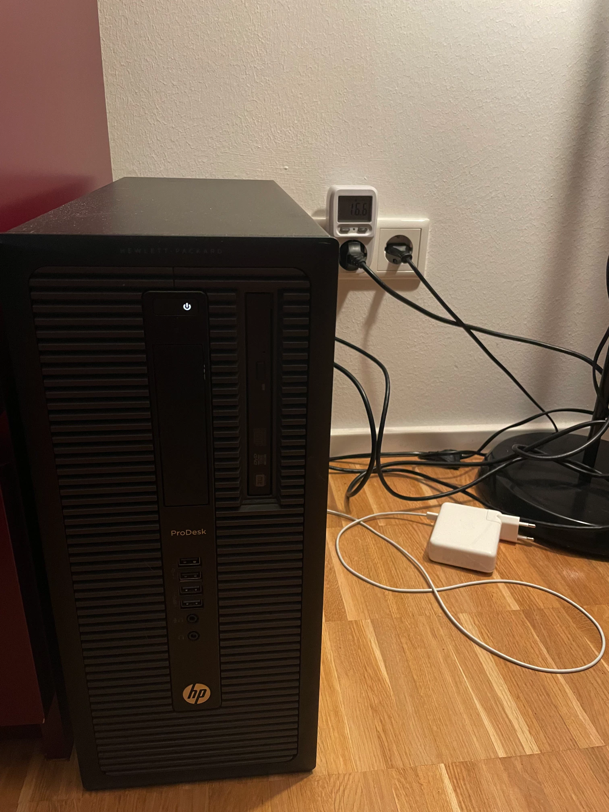
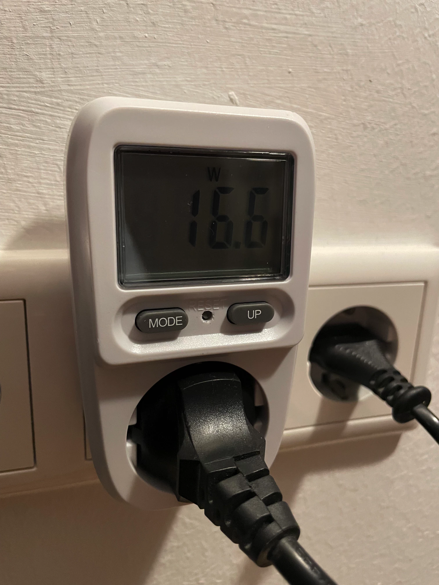

## But why?

I never really considered having a server, like a real one, at home. Perhaps had some thoughts about NAS that would work with Time Machine and such, but never really had some thoughts about a real server. Mainly due to a convoluted networking setups people have here in Germany.

The land where a public, static ipv4 is reserved for companies, and ipv6 is still "new land, a bright future".

Then I read some stories on Lemmy that [CloudFlare Tunnel](https://developers.cloudflare.com/cloudflare-one/connections/connect-networks/) is nice and easy to set up.

I thought, hey, that [kukei.eu](https://kukei.eu) database costs me way too much already due to its size, so why not turn this old PC I bought once that doesn't really run any games I bought it for, for something useful.

And it worked. So far at least.

## The setup

Setup is based on HP ProDesk 600 G2. Which seems to be some kind of business PC, although in a regular tower PC form.

I bought another 8GB DDR2 RAM module, so it has 16GB now, and I put there a 1TB SSD.

It seems more than enough to make [Meilisearch](https://meilisearch.com/) run the same, or faster, way than when it was running on Hetzner. Except, sometimes it's slower, but about it later.

For backups, I don't have a good solution now, and only relying on [borgbackup](https://borgbackup.readthedocs.io/) to my app to send the meilisearch dumps to Hetzner storage. So in case of total failure, I won't need to re-index entire kukei.eu sources again.

Entire thing runs on Ubuntu 22.04 (just because I know this system best), all server apps are running via Docker (so I don't install dependencies on my system and it's usually easier to update them).

## The networking

As mentioned above, Cloudflare Tunnel just works. Setup is super easy, took me maybe 2 minutes to get it running.

It has some weird issues with latency tho.

I have a benchmark server that does [nothing but responding with a text](https://home.nowicki.dev/). Within local network I get responses with 6ms delay. From the internet it's anything from 60 (okish), 200, up to 600ms.

What's weird is that it's usually highest at evenings and drops below 100ms during the working days.

First I blamed the Tunnel to be derp but having the above in mind I actually think it's more related to the internet usage of my neighbours.

This is just a theory since sometimes when I do benchmarks nothing makes sense. Like, I get high latency when calling from home (Frankfurt area), which is a chain of my home > FRA CF -> my home -> FRA CF -> home while having small latencies while being in a company VPN (my home -> FRA CF -> FRA CF -> my home -> back) while *a friend in Poland* has something in between.

I will monitor still, because having kukei.eu results above 1s is not acceptable. But still I ain't paying that cloud VPS because nobody donates to this project.

## Power consumption

You may ask whether it even makes sense in terms of costs.

It does.

I checked, and when idle this desktop takes ~16W. When indexing it goes up to 50W peaks.

For 0,26 EUR per kWh it's not that much, 4¢ is about a cost of a single Hetzner VPS.

## The future

If it works fine with kukei.eu I think I'll also move my Mastodon instance there. Then I'm fully "self-hosted".

For static websites, like kukei.eu frontend, this blog and others I have no intention of moving out of CloudFlare Pages since the whole package there is perfect (CI/CD, edge network, no-cost).

One day I maybe will also get ipv6, so then I can reduce the latency by replacing the Tunnel with a normal CF DNS proxy.
