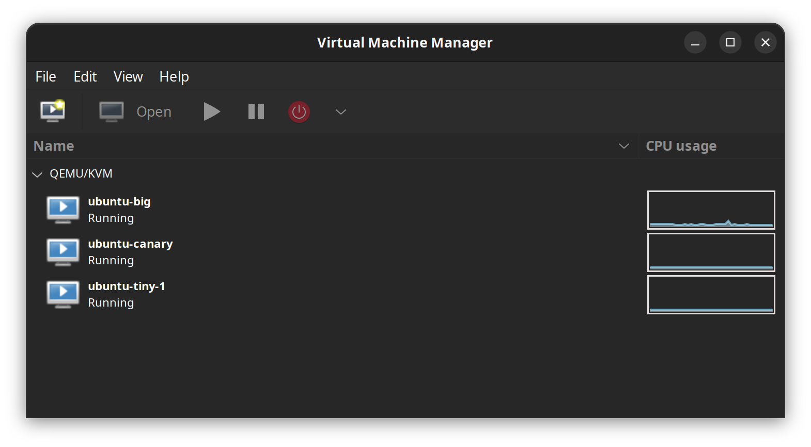
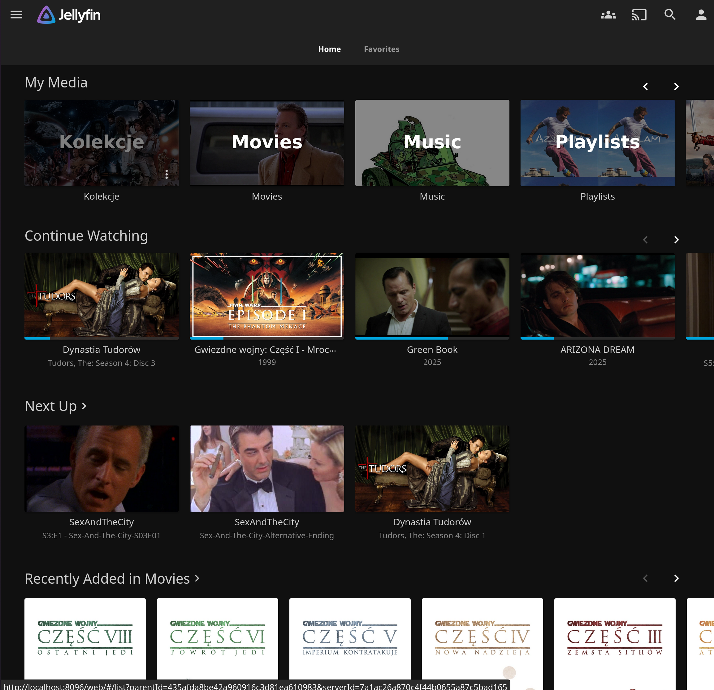
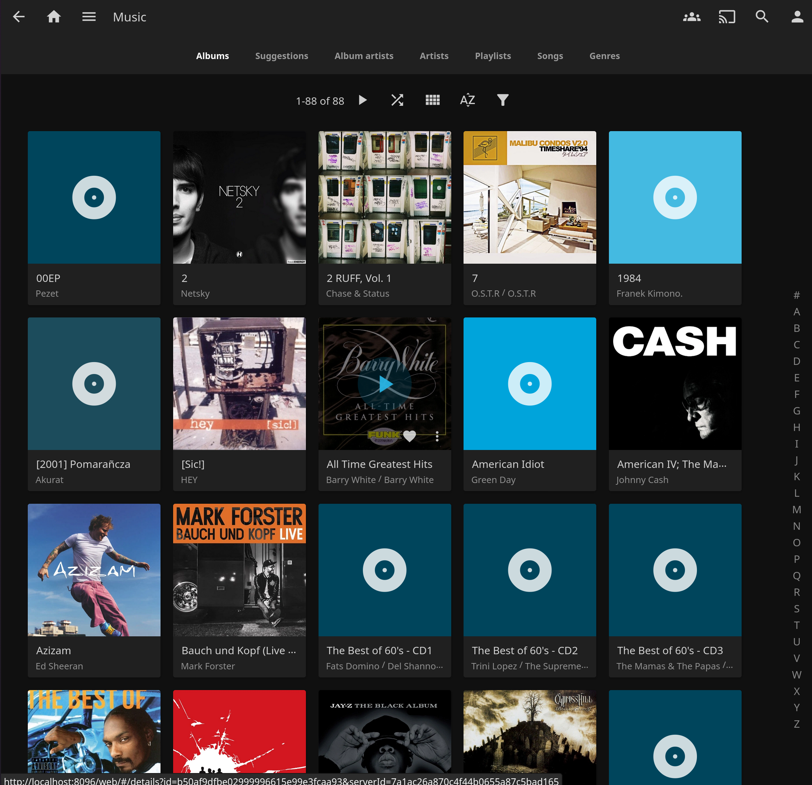
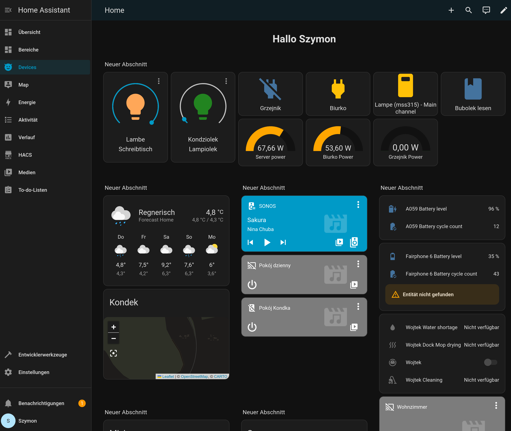

## Entrophy is a thing

Since I [moved most of my services and websites to a home server](/self-hosting-lvm-raid1-with-key-over-ftp), I can't complain about boredom. Which is a good thing, especially when my hobby serves some bigger purpose (like [masto.kukei.eu](https://masto.kukei.eu)) and in the same time gives me some place to experiment with stuff that I don't touch at work.

But it also means that this thing changes all the time and since I wrote my last post, many, many things has changed.

Here's the update of how my setup looks like today, as of end of 2025.

## Tailscale and Cloudflare Tunnels

In the begining I had Cloudflare Tunnels connected to bare metal Ubuntu. That was cool, but eventually I also wanted to have some better access to some stuff like Jellyfin that is explicitly against CF terms of service.

Cloudflared and tailscale on same machine is not a great idea (it doesn't work) so I was postponing that whole thing until I actually had a new use case where I could try it and new idea how to tackle it in a much better way - with Virtual Machines.

### VM per purpose

The setup is as follows:

* ubuntu-big - all the public stuff like Mastodon, websites and things that are OK for Cloudflare to proxy. This has Cloudflared daemon
* ubuntu-tiny-1 - this is a tiny server that only hosts Tailscale client and acts as an entry to my home network for all the other devices
* ubuntu-canary - smallish server for hosting everything I don't want to route via Cloudflare. Now it's only one single dockerized Wordpress instance that I host for my brother-in-law

All VMs have a static IP in my local network + tailscale IP/host (except ubuntu-big)

### Networking

#### Public stuff

I have one single VPS on Hetzner that used to only host my Matrix service. For the purpose of an public ingress node, I installed Tailscale there too, and now that public domains that should not be routed through CF are pointing to that server IP. Nginx takes the rest with a reverse proxy to tailscale internal server IP.

Tailscale is not the fastest thing so for a smaller websites that customers are only in Europe it works fine. For global reach CF is still the best.

#### Private stuff

Things that I don't need to expose to the public internet (Jellyfin) use Tailscale only and are still hosted on Ubuntu host (bare metal). I've installed Tailscale client on all our family devices, including my wife's iPhone and we all now have access to all my Audio CDs and Bluray ripps, everywhere in the world.

## Jellyfin, VLC, NAS, Home Assistant

Yes, I jumped in the rabbit hole and I don't even complain.

It started with me discovering that Sony headphones are better sounding with Apple Music on old crappy Android than on iPhone 16. That was some time ago.

Now, I *think* I can hear a difference between FLAC + LDAC vs whatever streaming service.

Also, the idea of having videos and music I really like, like actually having it, started to creep into my mind and eventually realised with me hoarding CDs and Blurays on Kleinanzeigen, Amazon and some other niche shops that sell those things.

I mostly buy used stuff but sometimes also new. The rule of thumb is that it must be cheaper than a cinema ticket.

### Movies

With movies the problem is that a good quality is only provided by Bluray. Any kind of DVD looks really crappy so unless the film is also old and crappy in terms of quality (like Sex And The City), Bluray is the only way to feel good watching it.

I bought some recommended Bluray portable device from Verbatim on Amazon (99€), flashed it with some shady firmware and bought the makemkv license.

And boy do I ripp now. I buy all sorts of movies, all the old one I love like Arizona Dream and Fiddler on the Roof. Also some stuff my son loves, like entire collection of Star Wars. And sometimes I don't buy anything, I find them on the street as in Germany people often put a box on a street with stuff they don't need any more. This way I found entire Sex and the City collecion (DVD) and some Blurays I'm not sure if I'm gonna watch but hoarders gonna hoard...

The cool thing about this approach is that you actually own it. Meaning, you can sell it as some point of time.

### Music

With music things are much easier. Ripping takes just few minutes, FLAC don't take too much space, and buying CDs is also surprisingly easy. It seems like new records are still being published as Audio CD and old ones are easy to find on Kleinanzeigen or Polish OLX.

Plus, I noticed that some albums have more tracks than on streaming services. The smell of a booklet also brings me back to 2000s as a bonus.

### Beyond jellyfin

I keep all the audio/video files on dockerized samba server. That means apart of Jellyfin it's also being used by Sonos (natively) and HomeAssistant, AND syncthing that I use to sync music with my Android device.

On Android there's an amazing app called [Musicolet](https://play.google.com/store/apps/details?id=in.krosbits.musicolet&hl=pl), that has really good folder based browser. Perfection. Offline.

### Home assistant

Home assistant is my 2025 major discovery. It helps in so many ways that's hard to explain.

I finally have access to proper automation and widgets without Google Home or some other provider mercy.

I can have a nice dashboard with current power usage of my devices, most common switches, even entire family GPS locations (again, without the mercy of Apple or Google).

And what's even cooler is that I can integrate it with Prometheus and Graphana and have a proper historical data of e.g. power usage of that chinese Matter-compliant power outlet.

It's a perfect software, when not in itself, then as a proxy to other plethora of tools.

And the best thing about it that it's pure web. No you-need-an-app-for-that. I can open my local 192.x website on my work laptop, and switch that light bulb, or check if my son is actually heading home, or listen to music via Jellyfin.

Web is standard. Apps should always be an extra convienience tool, not a required one.

## Backups

Backups strategy also changed a bit in that year with the VMs idea.

Now I don't need to backup Mastodon db, then go to some configs, then do some other stuff and then upload it with borg to Hetzner.

Now I just make a VM disk backup with `virtnbdbackup` and then carry on with a borgbackup setup. Simplifies both backup creation and eventual recovery.

For the host machine I don't care that much and don't really have anything automated (yet). Once I expand the storage space I'll leave on of those SSDs there to act as a simple backup solution. However it it all goes away I can recover most of this stuff in one day. All important (public) things like databases and service configs are in those VMs.

## Power usage

After expanding the setup by a lot I noticed around 3W increse of power usage on idle. From 35W to near 38W.

## Summary

Homelab is evolving, but that's the fun part. You own it, you customize it the way you want and it serves you.

This gives a lot of pleasure but also gives that freedom feeling of not being dependent on corporates.

I still have a contract with nearly all major streaming services, including YouTube premium with Music.

And I still use them. But the differnce is that I can actually leave them one day if I decide so and we will still have access to all our media.
